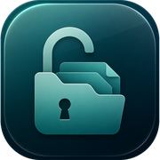

<div align="center">



# EscapeOS

On-device file browser and App Store app-data backup/restore for sideloaded iOS, using a path-scoped container sandbox escape. No jailbreak. No Keychain.

**Sideload the IPA with [iPASide](https://github.com/pwnapplehat/iPASide)** (Windows). iPASide creates the same kind of pairing file as [iLoader](https://iloader.site/docs/) and places `pairingFile.plist` after install. An iLoader file can be imported instead. After that, the PC is not required — EscapeOS talks to this iPhone over LocalDevVPN.

</div>

## What it does

- Lists installed user apps through LocalDevVPN + `pairingFile.plist` in Documents.
- Browses an app Data container (`Documents`, `Library`, `tmp`) after consuming a `bad_query` sandbox extension for that container UUID.
- Creates, previews, edits, and shares files in that container. Copy, Cut, and Paste work across folders (and across apps); Copy Path / Copy Bundle ID put text on the system clipboard.
- Exports a zip + `manifest.json` (SHA-256 per file) into Files → On My iPhone → EscapeOS → Backups, and restores that archive into the same app's current container.

## What it does not do

- Keychain
- Other apps' App Groups
- System paths (`/var/mobile`, parent container directories)
- The app's signed `.app` bundle (Data container only)
- iOS 15, 16, or 17 (the IPA will not install; `MinimumOSVersion` is 18.0)

## Requirements

**Supported: iOS 18 and iOS 26 only.**

| | iOS 18 | iOS 26 (26.4+) |
|---|---|---|
| **Use EscapeOS** | Phone + LocalDevVPN + Wi-Fi. No USB. | Same. |
| **App listing** | Lockdown loopback on `10.7.0.1:62078` (StikDebug 17.4–18 recipe). | Remote Pairing / RSD on `10.7.0.1:49152` (StikDebug 3.1+ / iOS 26.4 recipe). |
| **Pairing file** | USB-trust (lockdown) keys are enough. iPASide still writes Remote Pairing keys into the same file. | Lockdown-only files fail. File must include Remote Pairing keys (`identifier`, Ed25519 `public_key` / `private_key`). |
| **Container open (`bad_query`)** | Upstream: untested (“might also work on iOS 18”). Not hardware-tested here. | Upstream: **iOS 26.0–26.6.1 / 27.0b4**. |
| **Hardware** | **Not tested here** (no iOS 18 device). | **Verified** iPhone 17, iOS 26.5.1 (list apps, browse container, iPASide auto-place pairing). |

Also required:

- [LocalDevVPN](https://apps.apple.com/app/id6755608044) on default `10.7.0.1`
- Wi-Fi on
- Pairing file from [iPASide](https://github.com/pwnapplehat/iPASide) (Create keys / Place) or iLoader import. PC is only for minting and placing that file.

## Sideload

1. Install [iPASide](https://github.com/pwnapplehat/iPASide/releases/latest) on Windows.
2. Sideload `EscapeOS.ipa` from this repo's [Releases](https://github.com/pwnapplehat/EscapeOS/releases).
3. Trust the developer profile on the iPhone.
4. iPASide places `pairingFile.plist` automatically after sideload. To do it later: Settings → Pairing file → Place.
5. Unplug if you want. Install LocalDevVPN, connect it, leave Wi-Fi on, then open EscapeOS.

## Build (Theos / WSL)

This tree is built with Theos against the iPhoneOS 16.5 SDK, deployment target **iOS 18.0** (Linux clang). That IPA is what was verified on iOS 26.5.1. A Mac with Xcode 26 can relink against the iOS 26 SDK for Liquid Glass; see `docs/BUILD.md`.

```sh
export THEOS=~/theos
cd ~/apps/EscapeOS
make package FINALPACKAGE=1
# staged app: .theos/_/Applications/EscapeOS.app
```

After reinstall, place `pairingFile.plist` again: iPASide Settings → Pairing file → Place, Files sharing, or House Arrest.

## License

[GNU AGPL-3.0](LICENSE). Third-party origins are listed in [NOTICE](NOTICE): StikDebug adaptations (AGPL-3.0), `jkcoxson/idevice` (MIT), and `forcequitOS/bad_query` (no upstream license at adaptation time).
